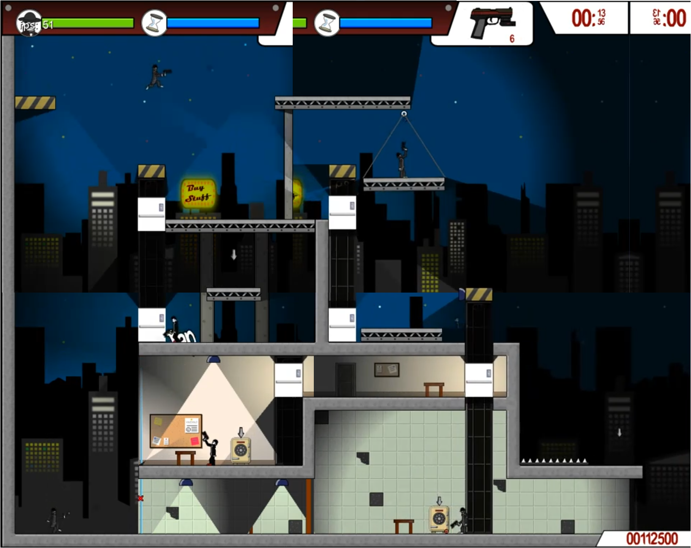
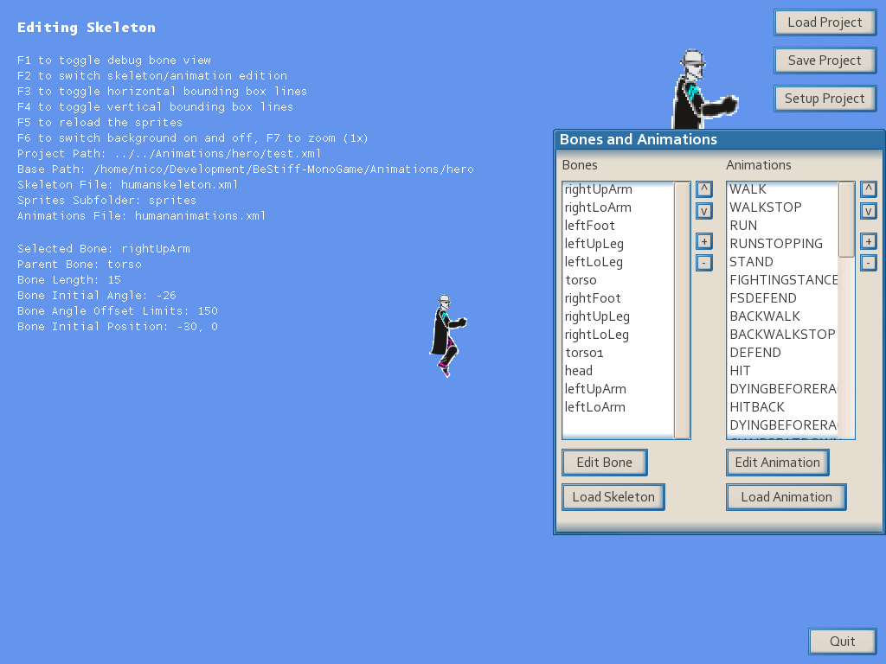

# Be Stiff – MonoGame port

Around 2009 I wanted to make a video game. I decided to learn C# and use XNA, which back then was such a cool framework (and still is). My inspiration was Elevator Action and my love for grappling hooks. Then I fell into feature creep and never finished a full level or even built a narrative. But I created so many cool things:
- An inverse kinematics engine for animating the characters
- An editor for them! You could add bones and a sprite for each, and even set rotation limits on the joints (so they don't look weird when they drop as ragdolls)
- Enemies resolving paths across complex maps, including taking elevators to go to a location
- Enemy squads: a few enemies could team up to search for the hero if they heard a sound
- A grappling hook, of course! With a semi-elastic rope, so you can swing and the rope can wrap around corners
- Music! I learned how to use Reaper and I think there is at least one decent tune
- Explosions in a 2D physics engine: blasts whose radius can be blocked by walls, built on top of the physics engine I imported
- Field of view, using HLSL shaders to hide objects behind walls

Anyway, life got in the way, I abandoned the project, and unfortunately the source code got lost. But recently I found an old build! So with the help of Claude, I managed to port the game to MonoGame, so it runs on modern computers and not just on Windows.




## Short description

Port of the original XNA 4.0 game to MonoGame 3.8.5 (DesktopGL, .NET 8).
The C# sources were recovered by decompiling the shipped binaries with ILSpy,
since the original project folder was lost.

## Layout

- `BeStiff/` – the game (MonoGame DesktopGL project). Content lives in
  `BeStiff/Content/`: the original compiled `.xnb` assets are used as-is,
  while shaders (`Effects/*.fx`) and music (`Audio/Music/*.ogg`) are rebuilt
  through the MonoGame content pipeline (`Content.mgcb`).
  Game code is grouped by area, one namespace per folder
  (`Be_Stiff.<Folder>`, imported project-wide in `GlobalUsings.cs`):
  - root – `Program`, `Game1`, `Globals` (options and save games),
    `GameSettings`, `DebugKeys`, `CaseInsensitiveContentManager`
  - `AI/` – enemy brains and their states, squads, path finding
  - `Audio/` – music/sound manager, noise events heard by enemies
  - `Characters/` – `Human`, `Hero`, enemies; `Characters/States/` holds
    the hero state machine
  - `Graphics/` – sprites, camera, particles, tiles, HUD;
    `Graphics/Backgrounds/` the parallax layers
  - `Input/` – keyboard/gamepad controls
  - `Levels/` – level loading, zones, portals, score, and
    `GameElementsControl` (the per-level world, split into partial files:
    core, `.Content`, `.Rendering`, `.Debug`)
  - `Physics/` – Farseer helpers: ray casts, contact handling, unit
    conversion, collision filters
  - `Screens/` – screen manager and all menus/screens
  - `Utils/` – small math, vector and string helpers
  - `Weapons/`, `Weapons/Projectiles/`
  - `WorldObjects/` – base classes and interfaces; `Props/`, `Goals/`,
    `Pickups/` for the concrete level objects
- `Libs/` – the third-party XNA libraries the game depends on, recompiled
  against MonoGame: Farseer Physics, DebugViewXNA, OgmoXNA, SKAnimation,
  Krypton, ProjectMercury. `EasyStorage` is a rewrite on plain file IO
  (the original used the removed XNA Storage/GamerServices APIs); saves go
  to `~/.local/share/BeStiff/`.
  `Nuclex.Support` and `Nuclex.UserInterface` (the GUI used by the animation
  editor) are decompiled and rebuilt the same way; `Nuclex.Input` is a small
  rewrite on MonoGame input (the original used Win32 message hooks and
  DirectInput).
- `Tools/AnimationEditor/` – the skeleton/animation editor used to author the
  characters, decompiled and ported to MonoGame. It edits the XML projects in
  `Animations/`.
- `Animations/` – source animation projects: skeleton and animation XML,
  per-bone sprites (PNG) and editor backgrounds.
- `Tools/fxccs/` – tiny Windows-side helper that MonoGame 3.8.5's effect
  compiler invokes inside Wine but does not ship. Build output is copied to
  `~/.winemonogame/drive_c/fxccs.dll`.
- `Tools/dx9dis.py` – DirectX 9 shader bytecode disassembler used to recover
  the game's pixel shaders from the compiled effects.

## Animation editor



```
dotnet run --project Tools/AnimationEditor -- Animations/hero/test.xml
```

Run it from the repository root. It needs only the .NET 8 SDK (none of the
Wine/shader setup below). The optional argument is a project file to open at
startup; otherwise use "Load Project" and type the path to the project file.

- F1–F6 toggle the debug views (listed on screen); F2 switches between
  skeleton and animation editing.
- F7 cycles the zoom (1x, 2x, 3x) for high-resolution screens. The initial
  zoom is the largest that fits the screen; `EDITOR_ZOOM=2` forces one.
- Saving writes the project's skeleton and animation XML in place, so keep a
  copy (or commit) before experimenting. The list of recently opened
  projects is stored in `recentFiles.xml` in the working directory.
- Projects saved on Windows still load: a base path that does not exist
  falls back to the project file's folder, and file names are matched
  regardless of case.
- `EDITOR_SHOT=<png>` / `EDITOR_SHOT_FRAME=<n>` save a screenshot after n
  frames (default 120).

Projects in `Animations/`:

- `hero/test.xml` – the hero, as authored (`sprites`).
- `hero/test2.xml` – the hero with the half-size art in `spritesa`
  (`humanSkeleton_half.xml`, `humanAnimations_half.xml`: bone positions,
  lengths and animation offsets halved).
- `hero/hero_lorez.xml` – the hero skeleton with the small `spriteslorez`
  art; those sprites fit the regular enemy's skeleton instead.
- `hero_game`, `regularguy` (also `project_pistol.xml`, and
  `project_lorez.xml` with `hero/spriteslorez`), `fatguy`, `turret` –
  imported from the game's compiled content.

`--import` turns a character compiled into the game's content (`.xnb`
skeleton, animations and bone sprites) back into an editor project, then
exits:

```
dotnet run --project Tools/AnimationEditor -- --import BeStiff/Content \
  Skeletons/Enemy/FatGuy/FatGuySkeleton Skeletons/Enemy/FatGuy/FatGuyAnimations \
  Sprites/Enemy/FatGuy Animations/fatguy
```

## Building on Linux

One-time setup (already done on this machine):

1. `sudo dnf install dotnet-sdk-8.0 wine-core p7zip`
2. Run MonoGame's `mgfxc_wine_setup.sh` (creates `~/.winemonogame` with a
   Windows .NET SDK and `d3dcompiler_47.dll`).
3. `winepath` wrapper in `~/.local/bin/winepath`:
   `#!/bin/sh` / `exec wine winepath "$@"`
4. `cd Tools/fxccs && dotnet build -c Release && cp bin/Release/net8.0/fxccs.* ~/.winemonogame/drive_c/`
5. `export MGFXC_WINE_PATH=$HOME/.winemonogame` (also appended to `~/.profile`).

Then:

```
# from the repository root
export MGFXC_WINE_PATH=$HOME/.winemonogame
dotnet build BeStiff
dotnet run --project BeStiff
```

Debug shortcut to skip the menus and load a level directly (also
auto-confirms the "get ready" box):

```
BESTIFF_LEVEL=Tutorial1 dotnet run --project BeStiff
```

Available levels: `Tutorial1`, `Tutorial2`, `TestLevel`.

`F12` in game saves `~/bestiff_shotN.png` plus the intermediate render
targets (`~/bestiff_shotN_*.png`) and prints the hero's state.

Debug switches (environment variables; "set" means any value):

| Variable | Effect |
|---|---|
| `BESTIFF_LEVEL=<name>` | Skip the menus, load that level, auto-confirm the "get ready" box |
| `BESTIFF_HERO_POS=x,y` | Teleport the hero to display (pixel) coordinates after the level loads |
| `BESTIFF_KEYS=<spec>` | Scripted input: hold keys during frame ranges, e.g. `100-150:D;200-230:Space,A` (frames counted from the first update, key names from `Keys`) |
| `BESTIFF_SHOT=<png>` | Save a screenshot (plus render targets, like `F12`) to that path at frame `BESTIFF_SHOT_FRAME` |
| `BESTIFF_SHOT_FRAME=<n>` | Frame for `BESTIFF_SHOT` (default 180) |
| `BESTIFF_DUMP` | Print diagnostics to stderr: level/grid scale, sprite scales, bones, texture regions, enemies, decals, bad platform/elevator velocities, first Krypton light passes |
| `BESTIFF_NO_CANNON` | Don't spawn wall cannons |
| `BESTIFF_JUMP_FRAME=<n>` | Apply an upward impulse to the hero at physics frame n |
| `BESTIFF_KILL_FRAME=<n>` | Kill the hero (ragdoll death) at physics frame n |
| `BESTIFF_KILL_ENEMY_FRAME=<n>` | Kill every enemy (ragdoll death) at physics frame n |
| `BESTIFF_DEATH_LOG` | Log the dead hero's body state every 10 physics frames |
| `BESTIFF_PERF` | Frame profiler: logs frames over 25 ms (split into update / draw steps / present wait), garbage collections, content loaded from disk, and a summary every 300 frames (allocation per frame, heap size) |
| `BESTIFF_STATE_LOG` | Log every hero state change (time, state names, body rotation, position, energy) |
| `BESTIFF_VIEW_BLUR` | Turn the "View Blur" option on regardless of the saved options |
| `BESTIFF_HIT_LOG` | Log every stick swing's hit test: shoulder, hand, hit box, hero position, reach, hits |
| `BESTIFF_GIRDER_LOG` | Log every girder's body and rope state every 15 physics frames |
| `BESTIFF_KRYPTON_DUMP=<prefix>` | Save the Krypton light map at frame 60 as `<prefix>_postlight.png`, `_blurH.png`, `_postblur.png` |
| `BESTIFF_KR_LOG` | Log the first two light passes' render state |
| `BESTIFF_KR_NOSTENCIL` | Draw lights without the shadow stencil test |
| `BESTIFF_KR_NOSCISSOR` | Draw lights without the scissor rectangle |
| `BESTIFF_KR_FLIPSCISSOR` | Flip the light scissor rectangle vertically |
| `BESTIFF_KR_NOCULL` | Draw lights with culling off |

## Porting notes

- The shipped build was mid-migration: the November 2011 project doubled
  character/object sizes (48 px grid) but `Tutorial2` and `TestLevel` were
  still exported against the August project (24 px grid), regular-enemy
  sprites, enemy animations, the fat guy skeleton and several object sprites
  were left at the old size. All hard-coded body sizes in the code match the old
  art at 24 display pixels per simulation unit, while the current project
  uses 48. The port detects such levels (grid bitmap vs. project grid) and
  plays them at 24 px/unit: pixel coordinates kept, catwalk tiles at 24 px,
  24 px collision grid, template-derived object sizes halved, hero skeleton
  and art at half, regular enemies with old-scale skeleton lengths, and the
  twelve sprites that were redrawn at 2x (slopes, exit door, barrels,
  chairs, table) drawn at half. Current-scale levels (Tutorial1) use 48
  px/unit with regular-enemy art at 2x and the fat guy skeleton scaled 2x.
  An old build lives in `~/Downloads/Be Stiff_old` and the Ogmo project in
  `~/Downloads/Maps` for reference.
- Krypton on OpenGL: MonoGame effect passes replace the whole rasterizer
  state, so every pass in `KryptonEffect.fx` sets `CullMode = None`
  explicitly (XNA kept the device state). The light map is cleared with
  alpha 0 and the shadow pass writes alpha 1, which the line-of-sight
  overlay (`AlphaShadow.fx`) uses as its fog mask.
- Farseer: bodies that come out of the solver non-finite are restored to
  their pre-step position (degenerate contacts under strict 32-bit floats).

- Asset names in the code use Windows casing and backslashes;
  `CaseInsensitiveContentManager` resolves them against the real files.
- The original effects only contained compiled `ps_2_0` bytecode. They were
  disassembled and rewritten as HLSL (`Content/Effects/*.fx`). Krypton's
  effect is the original source from the Krypton project (via the OUYA
  MonoGame port), which matches the compiled version's techniques.
- WMA music was converted to Ogg Vorbis with ffmpeg.
